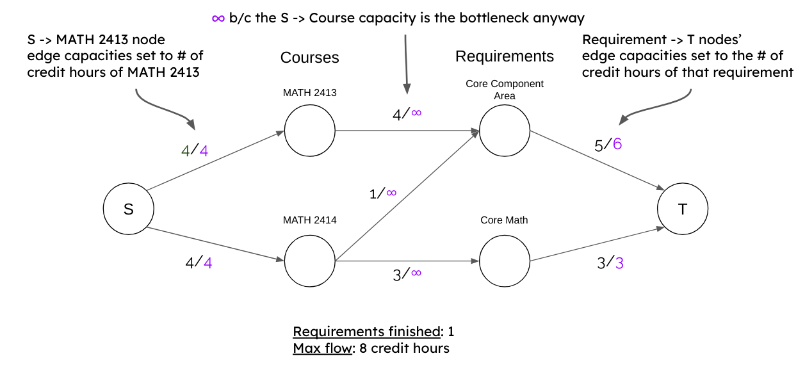

# Validator

The internals/algorithms of the Planner Validator.

## Overall Design

Because most (if not all) majors at UTD share the same core curriculum,
core validation tends to be quite stable, occuring on the same
set of requirements for each validation request. Unlike the core curriculum, most majors have their own unique twist
on their degree plans. Consequently, validation of major requirements
tends to be a minefield of edge cases.

Validation was originally written with core and major combined (only supporting Bio and CS degrees), but it was quickly discovered that many of the unique twists
in major requirements were unable to be modeled with the max-flow problem - and if
they were, it introduced too many complications.

As a result, validation was split into core and major; core validation still using
max-flow and major using a greedy algorithm. Because many majors include a free elective requirement (which is basically a catch-all), major validation relies on the output of core validation.

## Core

For design details and decisions, read [the original validator design](ORIGINAL_VALIDATOR.md) written by Eric Zhang.

Core validation uses the max-flow push-relabel algorithm provided by [Google OR-Tools](https://github.com/google/or-tools).

For general understanding of max-flow: https://www.youtube.com/watch?v=LdOnanfc5TM

To get a good idea of how push-relabel works: https://www.geeksforgeeks.org/introduction-to-push-relabel-algorithm

What max-flow looks for the "hour splitting" validation case:  

## Major

TODO(akevinge): writeup of the design
